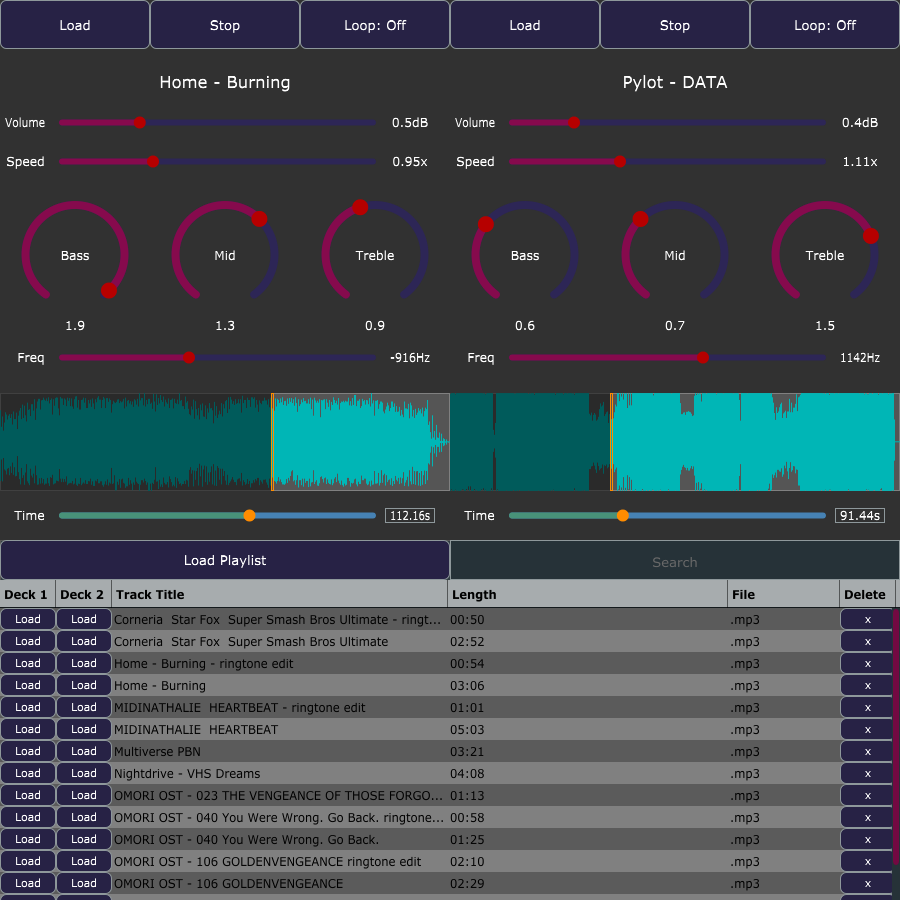

## JUCE_DJPlayer

DJ application that can load music and adjust playback. Similar to audio software, you can adjust bass, mid-range, and treble frequencies.

### Code
Written in C++ using the JUCE library

### Preview

CM2005 OOP Final project
